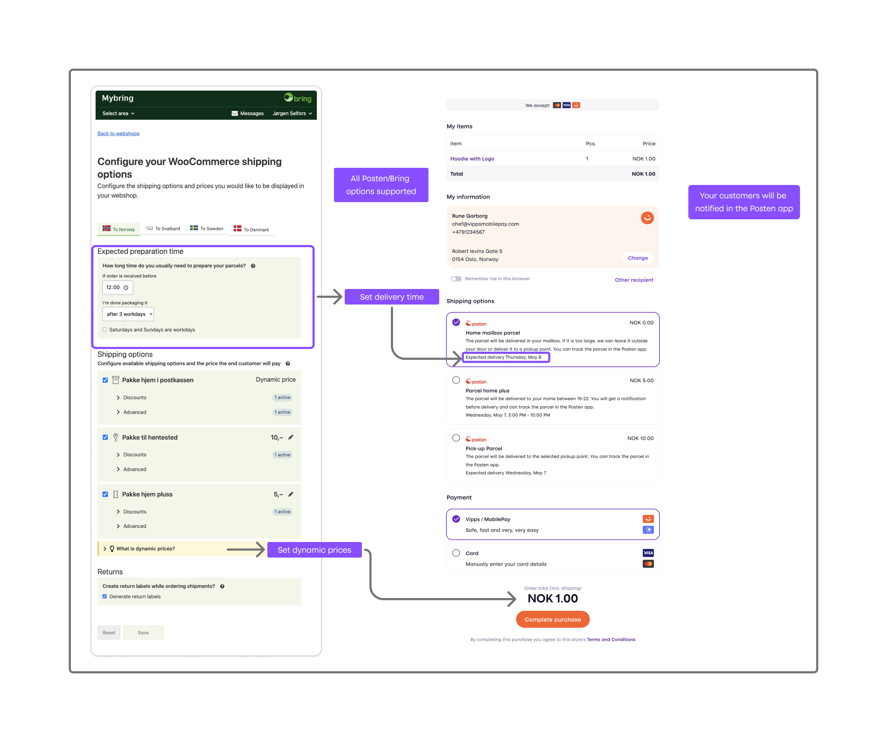
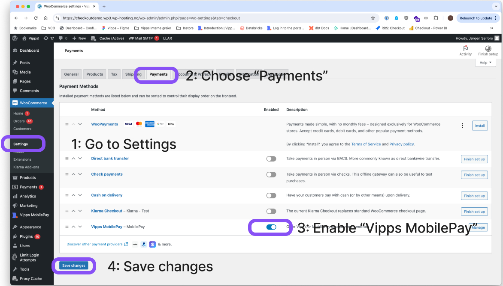
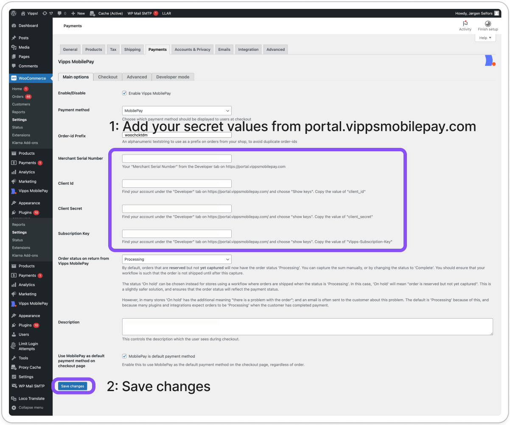
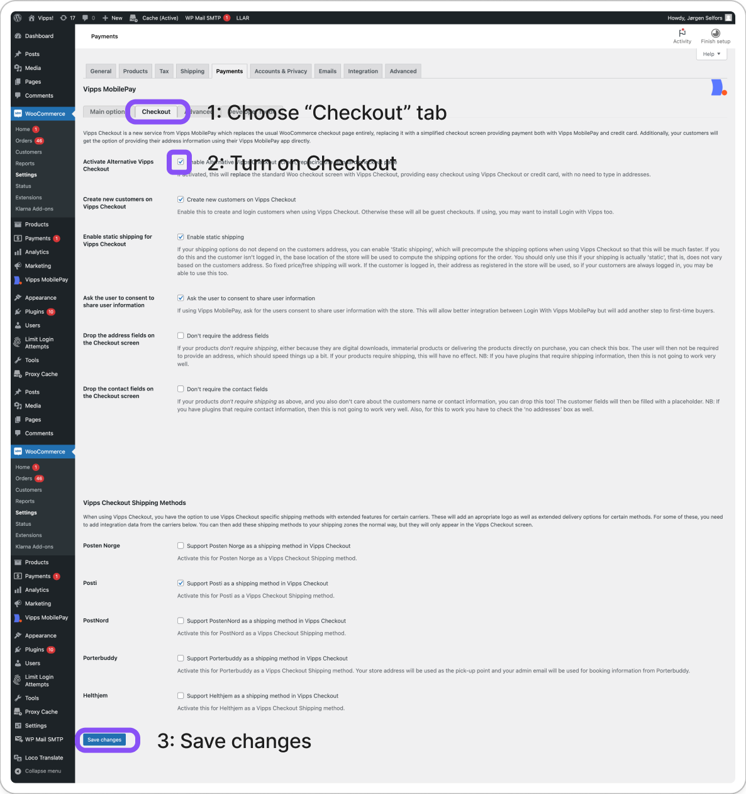

<!-- START_METADATA
---
title: "Vipps/MobilePay for WooCommerce plugin"
sidebar_position: 1
description: Official WooCommerce payment plugin for Vipps/MobilePay - Nordic's leading mobile payment solution with complete checkout integration.
pagination_next: null
pagination_prev: null
section: Plugins
---
END_METADATA -->

# Vipps/MobilePay for WooCommerce

*This plugin is built and maintained by [WP Hosting](https://www.wp-hosting.no/)
and can be downloaded from the [WordPress plugin site](https://wordpress.org/plugins/woo-vipps/).
For support, contact the
[support forum on WordPress.org](https://wordpress.org/support/plugin/woo-vipps).*

<!-- START_COMMENT -->
💥 Please use the plugin pages on [https://developer.vippsmobilepay.com](https://developer.vippsmobilepay.com/docs/plugins-ext/woocommerce/). 💥
<!-- END_COMMENT -->

*Official Vipps/MobilePay payment plugin for WooCommerce.*

*Branded locally as MobilePay in Denmark and Finland, and as Vipps in Norway and Sweden. One platform gathering more than 11 million users and more than 400,000 merchants across the Nordics. Give your users an easy, fast and familiar shopping experience.*

This is the official Vipps/MobilePay plugin for payments, a complete Checkout and Express checkout buttons. Increase your conversion rate by letting your customers pay with a fast, secure and convenient payment method. Vipps MobilePay allows users to make quick and easy payments using their mobile phone, without the need for entering credit card details or other sensitive information.

You can do important back-office tasks, such as capture and refund directly from WooCommerce.

For more information, see:

* [Pay with Vipps and MobilePay for WooCommerce](https://wordpress.org/plugins/woo-vipps/)

## Checkout

With Checkout enabled in the plugin, you will get a complete checkout in your web shop, designed and run by Vipps MobilePay.
Your customers can pay with Vipps, MobilePay, VISA or MasterCard, and they can also provide their shipping address and choose their preferred shipping method in a simple manner.

### NEW! Posten/Bring plugin and Checkout plugin

If you use [Posten Bring Checkout plugin for WooCommerce](https://wordpress.org/plugins/posten-bring-checkout/) together with Vipps MobilePay Checkout, you will get a streamlined shipping process tightly integrated with the market leading Vipps MobilePay Checkout. Both plugins are free to use, and easy to install.

You can offer your customers a variety of delivery methods, track shipments, print shipping labels, and calculate shipping costs automatically at checkout. Both plugins are designed for simple installation and management through the WooCommerce dashboard and supports both smaller and larger shops looking to streamline their payments with Vipps MobilePay and logistics with Bring.

👉 [Read more on Bring’s website](https://www.bring.no/radgivning/integrasjon/plugin-woocommerce)

Psst! If you’re thinking about e-commerce for small or medium businesses, this sort of automation can really help keep things simple!

## Vipps MobilePay Express

When you enable Vipps MobilePay Express, your customers can choose between the regular checkout or to go directly to Vipps or MobilePay. If they choose Vipps or MobilePay, they just submit their phone number, and the rest of the checkout process is done in the Vipps or MobilePay app.

Since Vipps MobilePay knows who the customers are, they don’t have to enter all their personal information. The customer just chooses the shipping method and accepts the payment. Vipps MobilePay will send all the necessary info back to the store. Easy, fast and secure.

The express checkout can be done in the following ways:

* From the cart
* From the category pages
* From the product page
* From shareable links distributed by email, banners, etc.
* From QR codes distributed digitally or in print

Settings for the cart, category and product pages can be found in the WooCommerce settings for the Vipps MobilePay payment gateway.

Shareable links and QR codes can be generated from the Vipps/MobilePay tab on the product page.

## Single payments

When you enable this plugin, your customers will be able to choose Vipps or MobilePay as a payment method directly in the standard WooCommerce checkout.
There is no need to go via a third party payment method.
When choosing Vipps or MobilePay, the customer fills in the name and address and is then asked to enter phone number on the Vipps/MobilePay landing page.
They then confirm the payment in the Vipps or MobilePay app.

## How to get started

* Sign up to use [*Checkout*](https://vippsmobilepay.com/online/checkout) or [*Payment Integration*](https://vippsmobilepay.com/online/payment-integration).
* After 1–2 days, you will get an email with login details to the [business portal](https://portal.vippsmobilepay.com/), where you can get the API credentials.
* Download and install the plugin.
* Configure the plugin.

## Installation

1. Install the plugin using the WordPress [built-in installer](https://codex.wordpress.org/Managing_Plugins#Installing_Plugins).
   The plugin can also be installed manually by uploading the plugin files to the `/wp-content/plugins/` directory.
2. Activate the plugin through the *Plugins* screen on WordPress.
3. Go to the *WooCommerce Settings* page, choose *Payments*, and enable Vipps MobilePay.
4. Go the *Settings* page for the Vipps MobilePay plugin and enter your Vipps MobilePay account keys. Your account keys are available in the [business portal](https://portal.vippsmobilepay.com/). For information, see [How to get account keys](#how-to-get-account-keys-from-the-business-portal).
5. (Optional, but recommended) Activate *Checkout* by clicking on the *Checkout* tab and selecting the *Enable Alternative Vipps/MobilePay Checkout screen, replacing the standard checkout page* option.

## How to get account keys from the business portal

1. Sign in to the [business portal](https://portal.vippsmobilepay.com/).
2. In the *Developer* section, choose *Production Keys*. Here you can find the merchant serial number (6 figures).
3. Click on *Show keys* under the API keys column to see *Client ID*, *Client Secret* and *0cp Apim Subscription Key*.

See:

* [Logging in to the portal](https://developer.vippsmobilepay.com/docs/knowledge-base/portal)
* [How to find the API keys](https://developer.vippsmobilepay.com/docs/knowledge-base/portal#how-to-find-the-api-keys)

## Screenshots

First, enable *Vipps MobilePay* as a payment method.

Enter your [API keys](/docs/knowledge-base/api-keys/) and configure the plugin.

Remember to enable Vipps MobilePay Checkout, if you want maximum dazzle with minimum hassle.

## Frequently asked questions

### In which countries can I use Vipps MobilePay?

You can get paid by users who have Vipps in Norway and Sweden, or who have MobilePay in Denmark or Finland.

### How do I set the default language?

The plugin should use the website language. The default is always English, and it is translated to whatever the current locale is. It's possible to modify translations and add more translations by using [Loco Translate](https://wordpress.org/plugins/loco-translate/) or you could contribute translations on [translate.wordpress.org](https://translate.wordpress.org/).

### For how long is an order reserved?

:::note
Payments initiated in Finland and Denmark have only 14 days to be captured; while
payments in Norway have 180 days.
If the payments aren't captured within this time, they will be automatically cancelled.

Payments can only be captured up to 14 days (MobilePay) or 180 days (Vipps) after reservation.
See [Reserve and capture](https://developer.vippsmobilepay.com/docs/knowledge-base/reserve-and-capture/).
:::

When a payment is completed with Vipps MobilePay, the money will be reserved, but only transferred to the merchant when the order is set to “Complete” or the money is captured manually. For MobilePay, this reservation period is 14 days, so you will need to ship and fulfill orders before this; or to make an agreement with the customer to capture the money before this period is over. For Vipps, the period is 180 days. The reserved period for payments made by credit card in Vipps/MobilePay Checkout can be as short as 7 days.

If the order only contains virtual and downloadable products, the plugin will capture the order automatically and set the order to “Completed” as is the standard WooCommerce rule.

### Does Vipps MobilePay offer a test environment for the plugin?

For developers that want to contribute to the development of the plugin, there is a test environment.

You will need an account for direct integration with the payment APIs, which can be ordered from
[*Payment Integration*](https://vippsmobilepay.com/online/payment-integration).

If you already have a Vipps or MobilePay account for WooCommerce and want to contribute to
the development of the plugin, contact
[customer service](https://help.vippsmobilepay.com)
to *upgrade* your account with access to the test environment.

You will also need to install a special test version of the Vipps MobilePay app, available
through TestFlight. See
[Test apps](https://developer.vippsmobilepay.com/docs/knowledge-base/test-environment/#test-apps)
for more information.

API keys for both the test and production environment are available on the
[business portal](https://portal.vippsmobilepay.com), where you log in.
See [Getting the API keys](https://developer.vippsmobilepay.com/docs/knowledge-base/portal/#how-to-find-the-api-keys)
for more information.

To use test mode in WooCommerce, switch *Developer mode* on. There you can input
the API keys for the test environment, and turn test mode on and off.

If you have defined the constant `VIPPS_TEST_MODE` to true, test mode will be forced on.

If this isn't practical for your usage, we recommend that you *test in production*
with a small amount, like 2 NOK. Just refund or cancel the purchase as needed.

### How can I get help if I have any issues?

For issues with your WooCommerce installation, use the
[support forum on WordPress.org](https://wordpress.org/support/plugin/woo-vipps).
For business-related issues, such as a deactivated sales unit, contact [Vipps MobilePay business support](https://help.vippsmobilepay.com).

### General questions

See the
[Knowledge base](https://developer.vippsmobilepay.com/docs/knowledge-base/)
for more help with Vipps MobilePay eCommerce.

## Requirements

* WooCommerce 3.3.4 or newer is required.
* PHP 7.0 or higher is required.
* An SSL Certificate is required.
* The port 443 must not be blocked for outward traffic.

## Support

For issues with this plugin, contact the
[support forum on WordPress.org](https://wordpress.org/support/plugin/woo-vipps).
